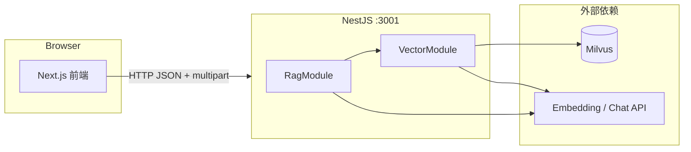

# RAG Project — 架构与开发说明

基于 **Milvus** 向量库与 **大模型（OpenAI 兼容 API，如阿里云 DashScope）** 的检索增强生成（RAG）单体应用：支持多格式文档入库、语义检索与对话式归纳回答。

---

## 目录

- [1. 技术栈](#1-技术栈)
- [2. 仓库结构（pnpm monorepo）](#2-仓库结构pnpm-monorepo)
- [3. 快速开始](#3-快速开始)
- [4. 系统架构总览](#4-系统架构总览)
- [5. 后端（NestJS）](#5-后端nestjs)
- [6. 文档解析与入库策略](#6-文档解析与入库策略)
- [7. 前端（Next.js）](#7-前端nextjs)
- [8. 数据流](#8-数据流)
- [9. Milvus 集合与字段](#9-milvus-集合与字段)
- [10. 环境变量](#10-环境变量)
- [11. HTTP API 一览](#11-http-api-一览)
- [12. 约束、限制与已知问题](#12-约束限制与已知问题)
- [13. 故障排查](#13-故障排查)

---

## 1. 技术栈

| 层级 | 技术 |
|------|------|
| 包管理 / Monorepo | pnpm workspace |
| 后端 | NestJS 11、Express、class-validator |
| 向量库 | Milvus（@zilliz/milvus2-sdk-node） |
| Embedding / LLM | @langchain/openai（OpenAIEmbeddings、ChatOpenAI），兼容 OpenAI 协议的网关（如 DashScope） |
| 文档解析 | epub2、pdf-parse@2（PDFParse）、mammoth（docx）、内置 pdf/txt/md |
| 前端 | Next.js 16、React 19、Ant Design 6、Tailwind CSS 4 |
| 共享契约 | `@rag/shared`（TypeScript 接口，workspace 依赖） |

---

## 2. 仓库结构（pnpm monorepo）

```
rag-project/
├── package.json              # 根脚本：build、dev（concurrently 前后端）
├── pnpm-workspace.yaml       # workspace 声明
├── shared/                   # @rag/shared — 前后端类型契约
│   └── src/index.ts
├── backend/                  # @rag/backend — NestJS，端口默认 3001
│   └── src/
│       ├── main.ts           # 入口：DOMMatrix polyfill → Nest 启动
│       ├── polyfills/        # Node 下 pdfjs 所需 DOMMatrix 等
│       ├── app.module.ts
│       ├── app.controller.ts # GET /api、/api/health
│       └── modules/
│           ├── vector/       # 入库、检索、知识库列表、冲突检测、按书名删除
│           └── rag/          # RAG：检索 + 大模型回答
└── frontend/                 # @rag/frontend — Next.js，端口默认 3000
    └── app/
        ├── layout.tsx
        ├── page.tsx          # 首页
        ├── knowledge/        # 智能问答
        └── personal/         # 文件上传、知识库表格、覆盖/增量上传
```

根目录执行 **`pnpm dev`**：并行启动 `dev:backend` 与 `dev:frontend`。

---

## 3. 快速开始

### 3.1 前置条件

- **Node.js**：建议 **20.16+ / 22.3+ / 23+**（`pdf-parse@2` 与 pdfjs 官方支持范围；版本过低可能出现 `process.getBuiltinModule`、渲染相关告警）。
- **pnpm**：与仓库锁文件一致。
- **Milvus**：本地或远程可达，默认 `localhost:19530`。
- **API Key**：配置兼容 OpenAI 协议的 Embedding 与 Chat（如阿里云百炼）。

### 3.2 安装与启动

```bash
pnpm install
# 在仓库根或 backend 上级配置 .env（见第 10 节）
pnpm dev
```

- 后端：`http://localhost:3001/api`
- 前端：`http://localhost:3000`
- 前端请求后端基址：环境变量 **`NEXT_PUBLIC_API_BASE`**（默认 `http://localhost:3001/api`），见 `frontend/lib/api-base.ts`。

### 3.3 首次问答前

需先向 Milvus **写入向量**（上传文档走 `/api/vector/ingest`），否则检索结果为空。

---

## 4. 系统架构总览



- **VectorModule**：负责 **入库**、**纯检索**、**知识库列表**、**冲突检测**、**按书名删除**（内部拆为多个 Service，见 5.3）。
- **RagModule**：在 **`VectorQueryService.search`** 之上调用 **Chat 模型**生成 `answer`。

---

## 5. 后端（NestJS）

### 5.1 启动顺序（`main.ts`）

1. **`./polyfills/dommatrix`**：为 `pdf-parse@2` / pdfjs 在 Node 中补齐 **`globalThis.DOMMatrix`**（浏览器 API 缺失会导致运行时报错）。
2. **`ValidationPipe`**：全局 DTO 校验（`whitelist`、`transform`）。
3. **全局前缀 `api`**：所有控制器路径均以 `/api` 为前缀。
4. **CORS**：`origin: true`，便于本地 Next 调用。

### 5.2 配置（`ConfigModule`）

环境变量由 **`ConfigModule.forRoot({ envFilePath: [...] })`** 加载，路径相对 **`backend/dist`** 解析（与是否从 `backend/` 目录启动无关）：

1. `rag-project/.env`、`rag-project/.env.local`
2. `backend/.env`、`backend/.env.local`

存在则加载；合并规则见 `@nestjs/config`（同名键以**先出现在列表中的文件**为准）。**一般只需在仓库根目录放一份 `.env` 即可。**

### 5.3 VectorModule（核心，按职责拆分）

| 文件 / 类 | 职责 |
|-----------|------|
| `vector.types.ts` | `VectorHitRow`、`MilvusInsertRow`、`MILVUS_MAX_QUERY_WINDOW` |
| `vector-milvus.service.ts` | Milvus 连接、建表/索引、`ensureMilvusLoaded`、`insertRows`、`searchByVector`、`queryScalar`、`deleteByFilter`、`resolveSearchOutputFields` |
| `vector-embedding.service.ts` | `OpenAIEmbeddings` 初始化、`embedQuery` / `embedDocuments`（含 **`EMBEDDING_BATCH_SIZE`**） |
| `vector-query.service.ts` | **`search`**：embedding + Milvus ANN，映射为 `VectorHitRow[]` |
| `vector-ingest.service.ts` | **`ingestUploadedFiles`**、EPUB 专链（`ingestEpubFile`） |
| `vector-library.service.ts` | **`listKnowledgeLibrary`**、**`findUploadConflicts`**、**`deleteVectorsByBookName`** |
| `vector.controller.ts` | 注入上述三类写读服务，对外 HTTP 不变 |

**`VectorModule` 仅 `exports: [VectorQueryService]`**，供 **RagModule** 依赖；入库与知识库能力不对外模块导出。

**`VectorController` 路由前缀：`vector`（完整路径见第 11 节）。**

### 5.4 RagModule

- **`RagService.answerWithRetrieval`**：`VectorQueryService.search` → 拼接 `hits` 为上下文（含书名、章节、相似度）→ 调用 **`ChatOpenAI`** → 返回 `{ hits, answer }`。
- 模型名默认 **`MODEL_NAME=qwen-coder-turbo`**，与 Embedding 共用 **`OPENAI_API_KEY` / `OPENAI_BASE_URL`**。

### 5.5 工具模块（`file-ingest.util.ts`、`epub-ingest.util.ts`）

- **文件名规范化** `normalizeUploadOriginalname`：缓解 Multer 将 UTF-8 文件名按 Latin-1 解码导致的乱码。
- **PDF**：使用 **`pdf-parse@2`** 的 **`PDFParse`**：`new PDFParse({ data: buffer })` → `getText()` → **`destroy()`**（不可用 v1 的 `pdf(buffer)`）。
- **EPUB**：临时写盘后用 `epub2` 链路抽章节文本，再 `RecursiveCharacterTextSplitter`（与 ebook-writer 脚本策略对齐）。

---

## 6. 文档解析与入库策略

| 扩展名 | 代码路径 | 分块策略 | Milvus 字段特点 |
|--------|----------|----------|-----------------|
| **.epub** | `ingestEpubFile` | 按章节 → 每章 500 字块、重叠 50 | `chapter_num` = 章节序号；`id` 与 `bookId_chapter_index` 风格一致（有长度截断规则） |
| **.pdf / .docx / .txt / .md** | `extractTextFromBuffer` + `chunkText` | 全文后 **`chunkText`**：默认约 900 字、重叠 120，按句号/换行择优断开 | 通常 **`chapter_num = 1`**，`id` 为 UUID |

**相同点：** 均写入同一 **`COLLECTION_NAME`**，检索与 RAG 不区分来源格式。

**冲突与覆盖（前端 `/personal`）：**

- 以文件名去扩展名得到 **`titleKey`**，与库中 **`book_name`** 比较。
- **覆盖**：`POST /api/vector/library/delete-by-book-name` 删除该书名下全部向量后再 `ingest`。
- **保留旧版再传**：直接 `ingest`，会产生新的 **`book_id`**（时间戳前缀），检索可能重复命中。

---

## 7. 前端（Next.js）

| 路径 | 作用 |
|------|------|
| `/` | 入口说明，跳转「开始提问」「个人信息」 |
| `/knowledge` | 输入问题与 `topK`，请求 **`POST /api/rag/answer`**，展示 Markdown 回答与引用片段 |
| `/personal` | 上传文件（XHR + `FormData` 字段 **`files`**）、展示 **`ingestLog`**、**知识库表格**（`GET /api/vector/library`）、上传前 **`GET /api/vector/conflicts`** 弹窗选择覆盖或增量 |

全局 **`App`** 包裹于 `providers.tsx`（Ant Design 中文、`message`/`modal` 上下文）。

---

## 8. 数据流

### 8.1 RAG 问答（读路径）

```
用户问题 → 前端 POST /api/rag/answer
         → RagService.answerWithRetrieval
         → VectorQueryService.search（embedQuery + Milvus COSINE topK）
         → 拼装 Prompt → Chat 模型 → { hits, answer }
```

### 8.2 文档入库（写路径）

```
前端 multipart files → POST /api/vector/ingest
                     → 按类型解析文本 → 分块 → embedDocuments（受 batchSize 限制）
                     → insert Milvus → flush → 返回 totalChunks、results、ingestLog
```

---

## 9. Milvus 集合与字段

创建逻辑见 **`VectorMilvusService`** 内 `bootstrapEmptyCollection`（字段类型以代码为准），主要包括：

- **`id`**（VarChar，主键）
- **`book_id`**、**`book_name`**
- **`chapter_num`**、**`index`**
- **`content`**（长文本，入库时内容会截断至安全长度）
- **`vector`**（FloatVector，维度 `VECTOR_DIM`）

检索时通过 **`VectorMilvusService.resolveSearchOutputFields`** 兼容旧集合缺少 **`book_name`** 的情况。

---

## 10. 环境变量

| 变量 | 默认 / 示例 | 说明 |
|------|-------------|------|
| `PORT_BACKEND` | `3001` | Nest 监听端口 |
| `MILVUS_ADDRESS` | `localhost:19530` | Milvus gRPC 地址 |
| `COLLECTION_NAME` | `ebook_collection` | 集合名 |
| `VECTOR_DIM` | `1024` | 向量维度，需与模型输出一致 |
| `OPENAI_API_KEY` | （必填） | 网关 API Key |
| `OPENAI_BASE_URL` | 视供应商 | 如 DashScope 兼容 OpenAI 的 base URL |
| `EMBEDDINGS_MODEL_NAME` | `text-embedding-v3` | Embedding 模型名 |
| `EMBEDDING_BATCH_SIZE` | `10` | 单次 embed 批大小；官方 OpenAI 可调大 |
| `MODEL_NAME` | `qwen-coder-turbo` | RAG 归纳用对话模型 |
| `NEXT_PUBLIC_API_BASE` | `http://localhost:3001/api` | 前端请求后端根路径 |

`.env` 推荐放在 **仓库根** `rag-project/.env`；也可使用 `backend/.env`（详见 `app.module.ts` 中 `envFilePath` 顺序）。

---

## 11. HTTP API 一览

| 方法 | 路径 | 说明 |
|------|------|------|
| GET | `/api` | JSON 说明与端点列表 |
| GET | `/api/health` | 健康检查 |
| GET | `/api/vector/library` | 知识库列表（按 book_id 聚合） |
| GET | `/api/vector/conflicts?filename=` | 上传前按书名键检测冲突 |
| POST | `/api/vector/library/delete-by-book-name` | Body: `{ "bookName": "..." }`，按书名删向量 |
| POST | `/api/vector/search` | Body: `{ query, topK? }`，仅检索 |
| POST | `/api/vector/ingest` | `multipart/form-data`，字段 **`files`**（多文件） |
| POST | `/api/rag/answer` | Body: `{ query, topK? }`，检索 + 回答 |

---

## 12. 约束、限制与已知问题

1. **Milvus Query 窗口**：单次 **`offset + limit`** 不得超过 **16384**（`max query result window`）。全库扫描列表与按书名统计在超大数据集上可能 **截断**（`truncated: true`）；同一 `book_name` 超过 16384 条时冲突统计也可能不完整。
2. **Embedding 批大小**：部分兼容网关限制单次 **≤10 条**，已通过 **`EMBEDDING_BATCH_SIZE`** 控制。
3. **pdf-parse@2 / pdfjs**：依赖 Node 较新版本；控制台可能出现 **`process.getBuiltinModule`**、**`ImageData`/`Path2D` polyfill** 等告警，多与 **Node 版本或 pdf 渲染路径** 有关；若仅抽取文本，一般仍可工作。已提供 **`DOMMatrix`** 启动 polyfill。
4. **纯扫描版 PDF**：可能抽出空文本，导致「未解析出有效文本」。
5. **按书名冲突**：依赖字段 **`book_name`**；旧集合若无该字段则无法按书名检测。

---

## 13. 故障排查

| 现象 | 可能原因 | 处理方向 |
|------|----------|----------|
| `DOMMatrix is not defined` | Node 无浏览器 Matrix API | 确认 `main.ts` 已 `import './polyfills/dommatrix'` |
| `batch size is invalid... larger than 10` | DashScope embedding 批限制 | 设置 `EMBEDDING_BATCH_SIZE=10`（默认已 10） |
| `invalid max query result window` | `limit` 或 `offset+limit` 超限 | 已按 16384 分页；升级后勿再使用单次超大 `limit` |
| 上传后仍检索不到 | 集合名不一致、未 flush、或未写入成功 | 检查 `COLLECTION_NAME`、Milvus 控制台、后端 `ingestLog` |
| 文件名乱码 | multipart 编码 | 后端 `normalizeUploadOriginalname` 已做常见修复 |

---

## 构建

```bash
pnpm build   # 递归执行各 workspace 的 build（backend nest build、frontend next build）
```

---

## 许可证与说明

内部 / 学习用 RAG 示例项目；生产环境需自行补充鉴权、限流、观测与密钥管理。
